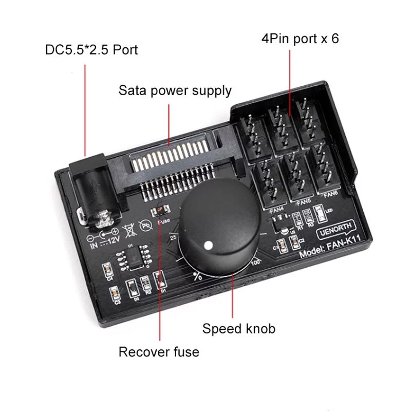
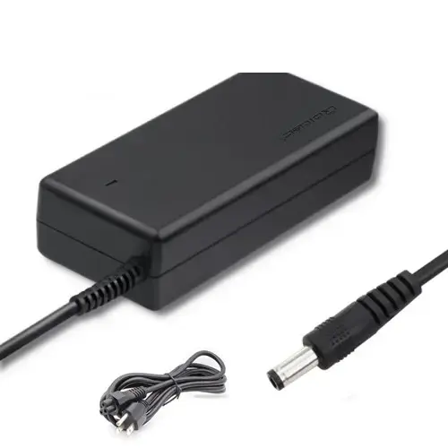

# Quiet Desk Fan Array — Build Guide

A standalone setup that runs **up to six Arctic P12 case fans** on a desk (not inside a PC), powered from a wall adapter, with **one knob for smooth, continuous speed control**. No motherboard, no computer needed.

> **What this is for:** turning silent PC case fans into a controllable, freestanding cooling array — for a desk, a server shelf, a 3D-printer enclosure, drying gear, cooling a router/mini-PC, or just moving air quietly. The whole point of the Arctic P12 is that it's quiet at low RPM, and the knob lets you keep it there.

---

## Parts gallery

| Stand + fans | Fan: Arctic P12 Pro PST | Stand: YUJINX | Hub/Controller: UENORTH FAN-K11 | Adapter: 12 V 3 A |
|:---:|:---:|:---:|:---:|:---:|
|  |  |  |  |  |

---

## The parts (shopping list)

Pick a value for `N` (number of fans, 1–6) and the table tells you what to order.

| # | Part | Qty | What it does | Price (THB) | Price (USD)[^usd] | Link |
|---|------|-----|--------------|-------------|-------------------|------|
| 1 | **Fan: Arctic P12 Pro PST** | `N` (1–6)<br/>buy as 5-pack if N≥5 | 120 mm, 4-pin PWM, ~200–2000 RPM, quiet. **Black or white.** Confirm 4-pin PWM model (not 3-pin, not Molex). PST = pass-through (unused here — the hub gives us 6 channels). | ฿377 single<br/>฿1,789 / 5-pack (≈฿358 ea) | ~\$11.40 single<br/>~\$54 / 5-pack | [Shopee](https://shopee.co.th/product/43263481/43358839984) |
| 2 | **Hub/Controller: UENORTH FAN-K11** | `1` | 6-channel knob hub — distributes power + one PWM speed knob to 6 fans. | ฿163 | ~\$4.95 | [Shopee](https://shopee.co.th/product/274611050/55909927519) |
| 3 | **Adapter: 12 V 3 A** (5.5×2.5 mm, center-positive) | `1` | Wall power → 12 V for the hub. A 5 A version works too, for more headroom. | ฿149 | ~\$4.50 | [Shopee](https://shopee.co.th/product/17087306/10301217851) |
| 4 | **Stand: YUJINX** | `0` to `N` | Holds each fan upright, 360° tilt. Fits 120/140 mm. **Black or white** — match (or contrast) the fans. Only order as many as you want freestanding; mount the rest however. | ฿238 each | ~\$7.20 each | [Shopee](https://shopee.co.th/product/1120602245/56458012260) |
| 5 | **Hub/Controller: Pcbfun Type-C 5V→12V** *(alternative to #2+#3)* | `0` normally;<br/>`1` for USB-only build | **Only for a 1–2 fan USB-powered build.** Replaces both the FAN-K11 and the 12 V adapter — runs off a USB-C 5 V source (charger, power bank, laptop). **Pick the "Type C 5V to 12V" variant** (not `DC5521` or `Type C 12V`). See [Option C](#option-c--usb-power-5-v-boosted-to-12-v--for-a-single-fan-power-bank-friendly-build). | ฿310<br/>(~฿217 after vouchers) | ~\$9.40<br/>(~\$6.60 after vouchers) | [Shopee](https://shopee.co.th/product/213822361/41769185475) |

### Cost by fan count

Every build includes the hub (฿163) + adapter (฿149) = **฿312 fixed**. Stands add ฿238 per fan if you want them. The P12 Pro PST is cheaper per fan in the 5-pack (฿358 ea) than as a single (฿377 ea), so the optimal purchase path changes at N=5.

| Fans | Fan purchase | Total w/ stands (THB) | (USD)[^usd] | Total no stands (THB) | (USD) |
|-----:|--------------|----------------------:|------------:|----------------------:|------:|
| 1 | 1 × single (฿377) | ฿927 | ~\$28 | ฿689 | ~\$21 |
| 2 | 2 × singles (฿754) | ฿1,542 | ~\$47 | ฿1,066 | ~\$32 |
| 3 | 3 × singles (฿1,131) | ฿2,157 | ~\$65 | ฿1,443 | ~\$44 |
| 4 | 4 × singles (฿1,508) | ฿2,772 | ~\$84 | ฿1,820 | ~\$55 |
| 5 | 1 × 5-pack (฿1,789) | ฿3,291 | ~\$100 | ฿2,101 | ~\$64 |
| 6 | 1 × 5-pack + 1 single (฿2,166) | ฿3,906 | ~\$118 | ฿2,478 | ~\$75 |

> **Money-saving note:** stands are the biggest scaling cost. If you're mounting the fans to something else (a frame, an enclosure wall, zip-tied to a shelf), skip them — see the "no stands" column.

---

## What the combination can do

- **Run 1 to 6 fans** off a single wall plug.
- **Continuous speed control** from a single knob — **0% to 100%** on the printed scale (Min ↔ Max). Smooth, not stepped.
- **Proper PWM control**, which means the fans can idle slow and quiet without stalling (voltage-dimming, the cheap alternative, makes fans buzz or stop at low speed — this avoids that).
- **One knob controls all fans together** — they speed up and slow down as a group. You *cannot* set fan 1 slow and fan 4 fast.
- **Over-current protection** via a resettable "recover fuse" on the hub — if something overloads it, it trips and recovers instead of frying.

### Power headroom (can it really do 6?)

Six Arctic P12 Pro PST fans at full speed draw roughly:

> **~24 W** total
> (6 fans × ~0.33 A × 12 V ≈ 24 W) — *0.33 A is the rated max for the P12 Pro line; the standard (non-Pro) P12 PWM draws less (~0.22 A), so a non-Pro build has even more headroom.*

The hub is rated **60 W max**, and the adapter supplies **36 W (12 V × 3 A)**. So:

- **Adapter (36 W)** comfortably covers six fans (~24 W) with margin for startup surge. ✅
- **Hub (60 W)** is never the bottleneck for six P12s. ✅
- Running the fans dialed-down (the normal use case) draws far less than 24 W.

> If you ever push past six fans' worth of load, the **adapter** is the limit, not the hub — you'd need a bigger brick (see power options below).

---

## How to put it together

```
 Wall outlet
     │
     ▼
[12 V 3 A adapter]  ──5.5×2.5 barrel──►  [FAN-K11 hub]  ──4-pin──►  Fan 1
                                              │         ──4-pin──►  Fan 2
                                         [speed knob]   ──4-pin──►  Fan 3
                                                        ──4-pin──►  ... up to 6
```

1. **Mount each fan** in its YUJINX stand (tool-free thumb screws) — or to wherever you're putting them.
2. **Plug each fan's 4-pin connector** into one of the hub's FAN1–FAN6 ports. Order doesn't matter.
3. **Connect power** to the hub — plug the 12 V adapter's barrel into the hub's **DC 5.5×2.5 port** (top-left on the board). *Don't* use the SATA input — that's an alternative you don't need here.
4. **Plug the adapter into the wall.**
5. **Turn the knob** to set speed. All connected fans respond together.

> **Polarity matters:** the hub's barrel jack is **center-positive** (inner = +). The recommended adapter is already center-positive, so this is handled — but if you ever swap adapters, don't use a center-negative one.


<br/>


---

## Power input options (and what each one needs extra)

The FAN-K11 hub can be fed several ways. The build above uses **Option A**. The others exist depending on what power source you have handy.

### Option A — 12 V wall adapter via DC barrel ✅ *(recommended, what's in the parts list)*
- **Needs:** the 12 V 3 A adapter (part #3). Nothing else.
- **Pros:** simplest, no boosting losses, plenty of current for all 6 fans.
- **Cons:** none for this use. Tethered to a wall outlet.

### Option B — SATA power (from a PC power supply)
- **Needs:** the hub plugged into a spare **SATA power** lead inside a running PC, *or* a standalone PSU.
- **Pros:** if this lived inside a PC, you'd use this and skip the wall adapter.
- **Cons:** pointless for a standalone desk setup — defeats the "no computer needed" goal.

### Option C — USB power (5 V boosted to 12 V) — *for a single-fan, power-bank-friendly build*
- **Needs:** a **different** controller — the **Hub/Controller: [Pcbfun Type-C 5V→12V PWM controller](https://shopee.co.th/product/213822361/41769185475)** (฿310 / ~\$9.40, or ~฿217 / ~\$6.60 after Shopee vouchers).[^usd] It replaces *both* the FAN-K11 hub and the 12 V wall adapter — it has its own speed knob and takes USB-C 5 V directly.
- **⚠️ Variant matters:** the listing sells three variants — `DC5521`, `Type C 12V`, and `Type C 5V to 12V`. **You must pick `Type C 5V to 12V`** to run off ordinary USB-C 5 V power (charger, power bank, laptop port). The `Type C 12V` variant only works with PD chargers that explicitly negotiate a 12 V profile, and `DC5521` is a barrel-jack input not USB at all.
- **Why not for 6 fans:** the 5 V→12 V variant caps at **20 W input / ~18 W output (12 V × ~1.5 A)** per the listing spec. That's enough for **1–2 P12 Pro fans** (each ~0.33 A ≈ 4 W), not six.
- **Extra requirement:** a USB-A→USB-C cable if your power source is USB-A, plus a USB source able to supply ~1 A on the 5 V side (most modern chargers and power banks).
- **Use this option only** if you specifically want a tiny 1-fan build powered from a power bank or laptop port.

**Single-fan USB build cost (1 fan, no stand):** ฿377 (fan) + ฿310 (Pcbfun) = **฿687 / ~\$21**[^usd] — about the same as the 1-fan Option A build (฿689 without stand), but USB-powered.

### Summary

| Option | Power source | Max fans (P12) | Extra parts needed |
|--------|-------------|----------------|--------------------|
| **A — DC barrel** ✅ | 12 V wall adapter | 6 (hub limit) | Just the adapter |
| **B — SATA** | PC PSU | 6 | Inside-PC only; SATA lead |
| **C — USB boost** | USB-C 5 V → 12 V | 1–2 (P12 Pro) | Pcbfun "Type C 5V to 12V" controller (replaces hub + adapter) + USB-A→C cable + capable USB source |

> **Upgrading the adapter for more headroom:** if you want margin (or run all six flat-out 24/7), a **12 V 5 A (60 W)** adapter maxes out the hub. Make sure any replacement is **12 V**, **5.5×2.5 mm**, **center-positive**.

---

## Things to know before you rely on it

- **One knob = all fans together.** No independent per-fan speed. If your friend needs zones, they'd need multiple hubs (one knob each).
- **Fan sub-model:** the linked listing is the **P12 Pro PST** (black or white, sold as singles or 5-packs). "Pro" = higher RPM ceiling (~2000 vs ~1800) and slightly higher current draw (~0.33 A vs ~0.22 A) than the standard P12 PWM. "PST" = pass-through connector for daisy-chaining, which this build doesn't use (the hub provides 6 independent channels). If you swap to a non-Pro or RGB variant, recompute the wattage above.
- **Noise:** the P12 is quiet *at low-to-mid RPM*. At full speed it's audible. The knob is what keeps it quiet — that's the whole reason for this build over a cheap always-on fan.
- **Startup surge:** six fans starting at once briefly draw more than their running current. The 3 A adapter handles this; a 1 A adapter would not.
- **Plug size gotcha:** 5.5×2.5 mm and 5.5×2.1 mm look identical but the 2.1 pin is thinner and can sit loose. The recommended adapter fits both, and the hub is 2.5 mm, so this is fine — just don't grab a random 2.1-only adapter.

[^usd]: USD ≈ THB / 33 (rate as of 2026-05-22; will drift).
