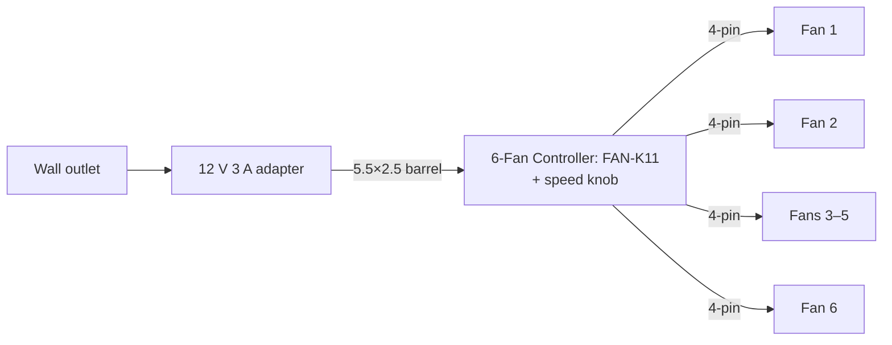

# Quiet Desk Fan Array — Build Guide

**Up to six Arctic P12 fans**, wall-powered, one knob for speed control. No PC needed. Good for a desk, server shelf, 3D-printer enclosure, drying laundry, or cooling a router/mini-PC.

---

## Parts gallery

| Stand + fans | Fan: Arctic P12 Pro PST | Swivel case fan stand: YUJINX | 6-Fan Controller: UENORTH FAN-K11 | Adapter: 12 V 3 A |
|:---:|:---:|:---:|:---:|:---:|
|  |  |  |  |  |

---

## Shopping list

Pick `N` (1–6).

| # | Part | Qty | Notes | THB | USD[^usd] | Link |
|---|------|-----|-------|----:|----------:|------|
| 1 | **Fan: Arctic P12 Pro PST** | `N` | 120 mm, 4-pin PWM, ~200–2000 RPM. Black or white. | ฿377 | ~\$11.40 | [Shopee](https://shopee.co.th/product/43263481/43358839984) |
| 2 | **6-Fan Controller: UENORTH FAN-K11** | `1` | PWM knob hub. | ฿163 | ~\$4.95 | [Shopee](https://shopee.co.th/product/274611050/55909927519) |
| 3 | **Adapter: 12 V 3 A** | `1` | 5.5×2.5 mm, center-positive. 5 A also fine. | ฿149 | ~\$4.50 | [Shopee](https://shopee.co.th/product/17087306/10301217851) |
| 4 | **Swivel case fan stand: YUJINX** | `0`–`N` | 360° tilt, fits 120/140 mm. Black or white. | ฿238 | ~\$7.20 | [Shopee](https://shopee.co.th/product/1120602245/56458012260) |
| 5 | **1-Fan Controller: Type-C 5V→12V PWM controller** | `0` or `1` | Replaces #2+#3 for a USB-powered single-fan build. **Pick the `Type C 5V to 12V` variant.** See [Option C](#option-c--usb-powered-single-fan-build). | ฿310 | ~\$9.40 | [Shopee](https://shopee.co.th/product/213822361/41769185475) |

### Cost by fan count

| Fans | Total w/ stands (THB) | (USD)[^usd] | Total no stands (THB) | (USD)[^usd] |
|-----:|----------------------:|------------:|----------------------:|------:|
| 1 | ฿927 | ~\$28 | ฿689 | ~\$21 |
| 2 | ฿1,542 | ~\$47 | ฿1,066 | ~\$32 |
| 3 | ฿2,157 | ~\$65 | ฿1,443 | ~\$44 |
| 4 | ฿2,772 | ~\$84 | ฿1,820 | ~\$55 |
| 5 | ฿3,387 | ~\$103 | ฿2,197 | ~\$67 |
| 6 | ฿4,002 | ~\$121 | ฿2,574 | ~\$78 |

---

## Why this combination

- **Smooth PWM speed control** from the knob — no voltage-dim buzz or stall at low RPM.
- **Resettable over-current fuse** on the hub — trips and recovers instead of frying.

## Power budget

6 × P12 Pro PST @ full speed ≈ **24 W** (6 × 0.33 A × 12 V). Adapter = 36 W, hub rated 60 W — adapter is the bottleneck.

---

## How to put it together

1. **Mount each fan** in its YUJINX stand (tool-free thumb screws), or wherever else you're putting them.
2. **Plug each fan's 4-pin connector** into a FAN1–FAN6 port on the hub. Order doesn't matter.
3. **Connect power** — adapter's barrel into the hub's **DC 5.5×2.5 port** (top-left on the board).

> If you ever swap the adapter, use **center-positive** (the recommended one already is).

---

## Power input options

| Option | Source | Max fans | Notes |
|--------|--------|---------:|-------|
| **A — DC barrel** ✅ | 12 V wall adapter | 6 | The default. Swap to a 12 V 5 A brick to max out the hub's 60 W. |
| **B — SATA** | PC PSU | 6 | Only if you're putting this inside a running PC. |
| **C — USB-C boost** | USB-C 5 V → 12 V | 1 | Swap the 6-Fan Controller (FAN-K11) + adapter for a **1-Fan Controller (Type-C 5V→12V PWM controller)**. See below. |

### Option C — USB-powered single-fan build

A **1-Fan Controller: [Type-C 5V→12V PWM controller](https://shopee.co.th/product/213822361/41769185475)** replaces both the 6-Fan Controller (FAN-K11) and the 12 V adapter — its own speed knob, runs off USB-C 5 V from a charger, power bank, or laptop. White-labelled board; the linked listing is sold by Pcbfun.

⚠️ **Pick the `Type C 5V to 12V` variant.** The listing also offers `DC5521` (barrel input) and `Type C 12V` (requires a PD source negotiating a 12 V profile) — neither runs off ordinary USB 5 V.

The boost caps at ~18 W output (12 V × 1.5 A), so 1 P12 Pro is the ceiling.

---

## Gotchas

- **One knob = all fans.** No per-fan zones — for that you'd need a separate hub per zone.
- **P12 sub-model:** if you swap to non-Pro (~0.22 A) or RGB, recompute the wattage above.
- **Startup surge:** six fans starting together briefly exceed running current. The 3 A adapter handles it; a 1 A wouldn't.
- **5.5×2.5 vs 5.5×2.1 mm:** they look identical. The hub is 2.5 mm. The recommended adapter fits both, but don't grab a random 2.1-only one.

[^usd]: USD ≈ THB / 33 (rate as of 2026-05-22; will drift).
