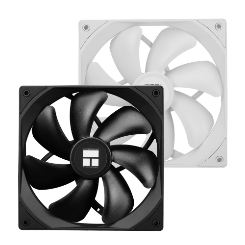
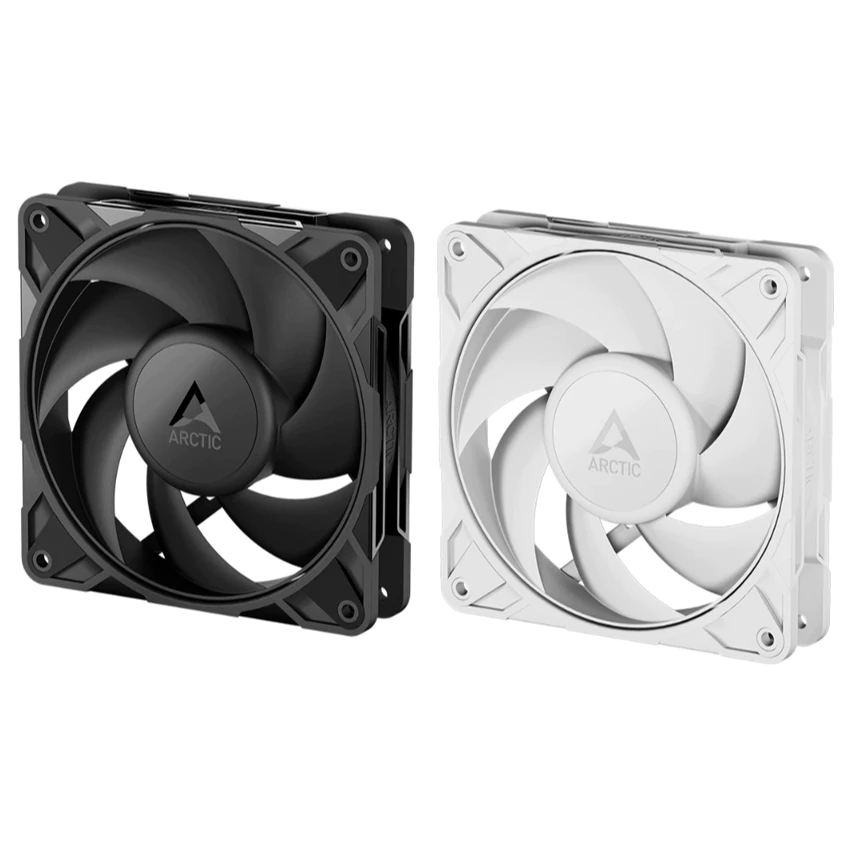
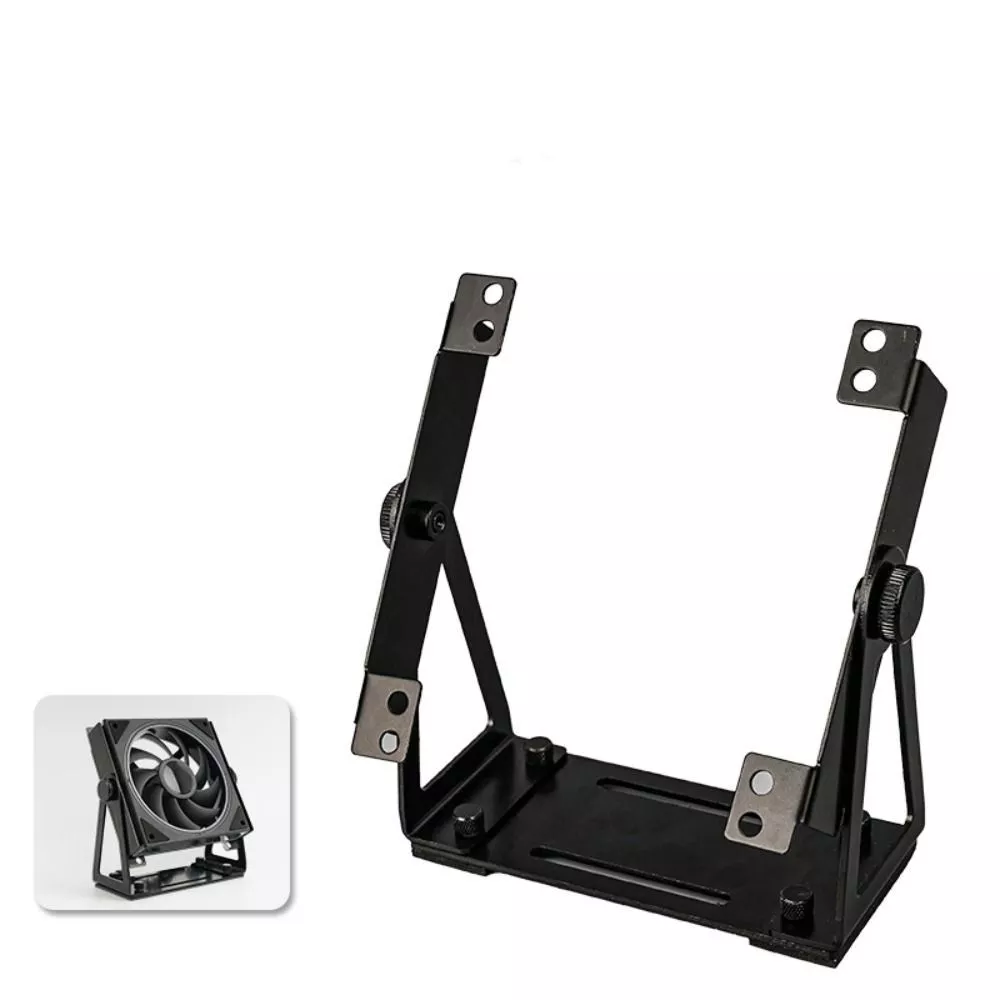
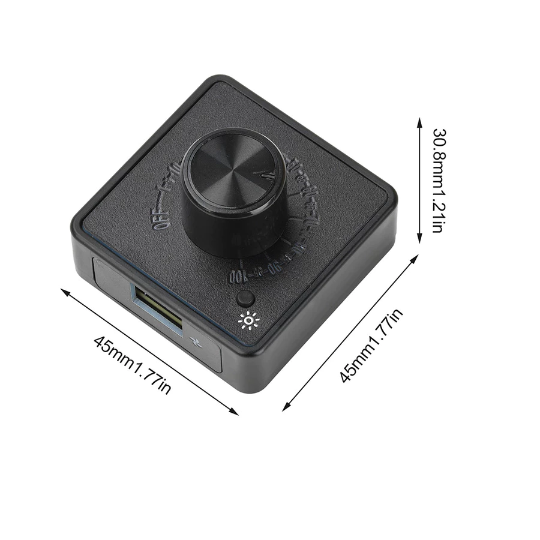
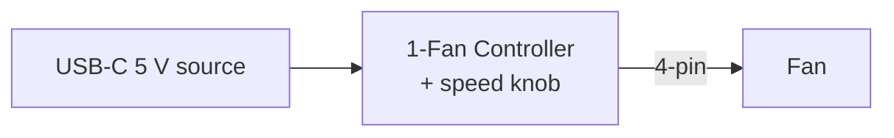
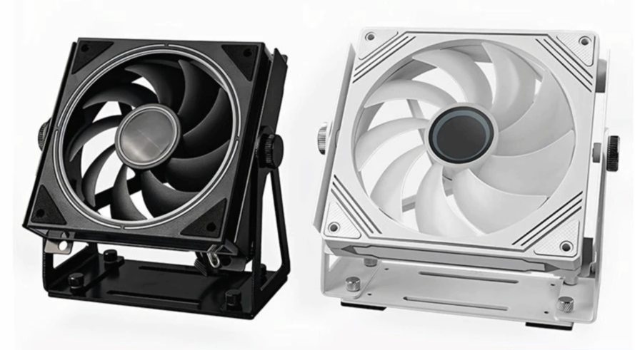
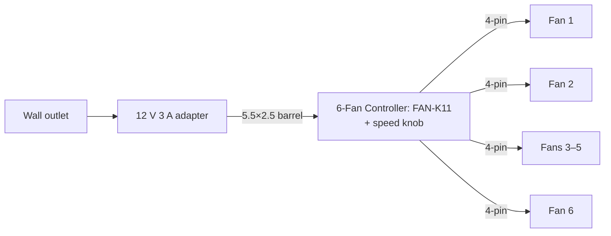

# Quiet Desk Fan Array — Build Guide

Quiet PWM case fans on a desk-friendly stand. Good for a desk, server shelf, 3D-printer enclosure, drying laundry, or cooling a router/mini-PC.

Two builds, depending on how you want to control fan speed:

- **[Build A: 1-fan](#build-a-1-fan)** — one controller per fan, USB-C powered, one knob per fan. Best for a single desk fan or for zoning.
- **[Build B: 6-fan](#build-b-6-fan)** — one knob drives 1–6 fans, wall-powered. Cheapest per fan once you go past 2.

Both share the same fans and stand — see [Common parts](#common-parts).

---

## Common parts

| Name | Image | Notes |
|------|:-----:|-------|
| **Fan: Thermalright TL-C14** (140 mm) |  | 4-pin PWM, 1500 RPM, S-FDB bearing. Black/white; `-S` suffix adds ARGB. Cheaper in packs — see [Pack discounts](#pack-discounts). |
| **Alternative fan: Arctic P12 Pro PST** (120 mm) |  | 120 mm option for tighter spaces — same 4-pin PWM, same stand. Wider RPM range (~200–2000 vs TL-C14's 1500 RPM max), and Arctic's PST (Pulse Sharing Technology) lets one fan's PWM signal drive a daisy-chained neighbour. 0.33 A per fan, black or white. Swapping shifts the wattage but stays under either build's adapter limit (6 × P12 Pro = 24 W). |
| **Swivel case fan stand: YUJINX** |  | 360° tilt, fits 120/140 mm. Black or white. |

### Pack discounts

The TL-C14 listing sells 1-, 3-, and 5-packs. Unit price drops with bigger packs:

| ARGB | ×1 | ×3 | ×5 |
|------|----:|----:|----:|
| ❌ | ฿222 (~\$6.73) | ฿195 (~\$5.91) | ฿179 (~\$5.42) |
| ✅ | ฿260 (~\$7.88) | ฿227 (~\$6.87) | ฿196 (~\$5.93) |

### Common gotchas

- **Fan sub-model:** ARGB or non-Pro variants change current draw — recompute against your build's power limit.
- **Startup surge:** multiple fans starting together briefly exceed running current. The recommended PSUs handle it; underspec'd ones won't.

---

## Build A: 1-fan

**One controller per fan, USB-C powered, one knob per fan.** Good for a single desk fan or for zoning where you want fans at different speeds. Scales by buying `N` of every row.

### Shopping list (per fan)

| # | Image | Part | Qty | Notes | THB | USD[^usd] | Link |
|---|:---:|------|-----|-------|----:|----------:|------|
| 1 |  | **Fan: Thermalright TL-C14** | `N` | See [Common → Fan](#fan-thermalright-tl-c14-140-mm). | ฿222 | ~\$6.73 | [Shopee](https://shopee.co.th/product/1257844740/41804012010) |
| 2 |  | **1-Fan Controller: Type-C 5V→12V PWM controller** | `N` | Pick the `Type C 5V to 12V` variant — see [Variant warning](#variant-warning). Cheaper on AliExpress (~฿191 / ~\$5.80) when shipping to Thailand. | ฿310 | ~\$9.40 | [Shopee](https://shopee.co.th/product/213822361/41769185475) · [AliExpress](https://th.aliexpress.com/item/1005009923198220.html) |
| 3 |  | **Swivel case fan stand: YUJINX** | `0`–`N` | See [Common → Stand](#swivel-case-fan-stand-yujinx). | ฿238 | ~\$7.20 | [Shopee](https://shopee.co.th/product/1120602245/56458012260) · [AliExpress](https://th.aliexpress.com/item/1005011662278182.html) |

Bring your own USB-C source per controller — any 5 V charger, power bank, or laptop port works.

#### Cost per fan

Shopee prices for everything:

| Per fan | THB | USD[^usd] |
|---------|----:|----------:|
| No stand | ฿532 | ~\$16 |
| With stand | ฿770 | ~\$23 |

Picking AliExpress for the controller and stand drops each fan by ~฿140 (~\$4).

### Why this build

- **Per-fan speed control** — each controller has its own knob, so you can run one fan slow and another fast.
- **USB-C power** — no wall brick; runs off any USB charger, power bank, or laptop port.
- **No hub to share.** White-labelled board; the Shopee listing is sold by Pcbfun.

### Power budget

Each controller's boost caps at ~18 W output (12 V × 1.5 A), so 1 fan per controller is the ceiling.

### How to put it together

Per fan:

1. **Mount the fan** in its YUJINX stand, or wherever you're putting it.
2. **Plug the fan's 4-pin connector** into the controller's fan output.
3. **Plug a USB-C cable** from your 5 V source into the controller.

### Variant warning

⚠️ **Pick the `Type C 5V to 12V` variant.** The listing also offers `DC5521` (barrel input) and `Type C 12V` (requires a PD source negotiating a 12 V profile) — neither runs off ordinary USB 5 V.

---

## Build B: 6-fan

**Up to six fans on one knob, wall-powered.** No PC needed.

### Parts gallery

| Assembled | 6-Fan Controller: UENORTH FAN-K11 | Adapter: 12 V 3 A |
|:---:|:---:|:---:|
|  |  |  |

Plus 1–6 [TL-C14 fans](#fan-thermalright-tl-c14-140-mm) and matching [YUJINX stands](#swivel-case-fan-stand-yujinx).

### Shopping list

Pick `N` (1–6).

| # | Image | Part | Qty | Notes | THB | USD[^usd] | Link |
|---|:---:|------|-----|-------|----:|----------:|------|
| 1 |  | **Fan: Thermalright TL-C14** | `N` | See [Common → Fan](#fan-thermalright-tl-c14-140-mm). Cheaper in packs — see [Pack discounts](#pack-discounts). | ฿222 | ~\$6.73 | [Shopee](https://shopee.co.th/product/1257844740/41804012010) |
| 2 |  | **6-Fan Controller: UENORTH FAN-K11** | `1` | PWM knob hub. | ฿163 | ~\$4.95 | [Shopee](https://shopee.co.th/product/274611050/55909927519) |
| 3 |  | **Adapter: 12 V 3 A** | `1` | 5.5×2.5 mm, center-positive. 5 A also fine. | ฿149 | ~\$4.50 | [Shopee](https://shopee.co.th/product/17087306/10301217851) |
| 4 |  | **Swivel case fan stand: YUJINX** | `0`–`N` | See [Common → Stand](#swivel-case-fan-stand-yujinx). | ฿238 | ~\$7.20 | [Shopee](https://shopee.co.th/product/1120602245/56458012260) · [AliExpress](https://th.aliexpress.com/item/1005011662278182.html) |

#### Cost by fan count

Assumes non-ARGB TL-C14 with optimal pack-buying.

| Fans | Pack picks | Total w/ stands (THB) | (USD)[^usd] | Total no stands (THB) | (USD)[^usd] |
|-----:|-----------|----------------------:|------------:|----------------------:|------------:|
| 1 | <ul><li>`1x × 1-fan`</li></ul> | ฿772 | ~\$23 | ฿534 | ~\$16 |
| 2 | <ul><li>`2x × 1-fan`</li></ul> | ฿1,232 | ~\$37 | ฿756 | ~\$23 |
| 3 | <ul><li>`1x × 3-fan`</li></ul> | ฿1,611 | ~\$49 | ฿897 | ~\$27 |
| 4 | <ul><li>`1x × 3-fan`</li><li>`1x × 1-fan`</li></ul> | ฿2,071 | ~\$63 | ฿1,119 | ~\$34 |
| 5 | <ul><li>`1x × 5-fan`</li></ul> | ฿2,396 | ~\$73 | ฿1,206 | ~\$37 |
| 6 | <ul><li>`1x × 5-fan`</li><li>`1x × 1-fan`</li></ul> | ฿2,856 | ~\$87 | ฿1,428 | ~\$43 |

### Why this build

- **Smooth PWM speed control** from the knob — no voltage-dim buzz or stall at low RPM.
- **Resettable over-current fuse** on the hub — trips and recovers instead of frying.

### Power budget

6 × TL-C14 @ full speed sits well under the 36 W adapter limit (140 mm non-ARGB fans typically draw 0.15–0.20 A; check your fan's label). Hub rated 60 W. With Arctic P12 Pros: 6 × 0.33 A × 12 V = **24 W**, still within budget.

### How to put it together

1. **Mount each fan** in its YUJINX stand (tool-free thumb screws), or wherever else you're putting them.
2. **Plug each fan's 4-pin connector** into a FAN1–FAN6 port on the hub. Order doesn't matter.
3. **Connect power** — adapter's barrel into the hub's **DC 5.5×2.5 port** (top-left on the board).

> If you ever swap the adapter, use **center-positive** (the recommended one already is).

### Power input options

| Option | Source | Max fans | Notes |
|--------|--------|---------:|-------|
| **A — DC barrel** ✅ | 12 V wall adapter | 6 | The default. Swap to a 12 V 5 A brick to max out the hub's 60 W. |
| **B — SATA** | PC PSU | 6 | Only if you're putting this inside a running PC. |

### Build B gotchas

- **One knob = all fans.** No per-fan zones — for that, see [Build A](#build-a-1-fan).
- **5.5×2.5 vs 5.5×2.1 mm:** they look identical. The hub is 2.5 mm. The recommended adapter fits both, but don't grab a random 2.1-only one.

---

[^usd]: USD ≈ THB / 33 (rate as of 2026-05-22; will drift).
